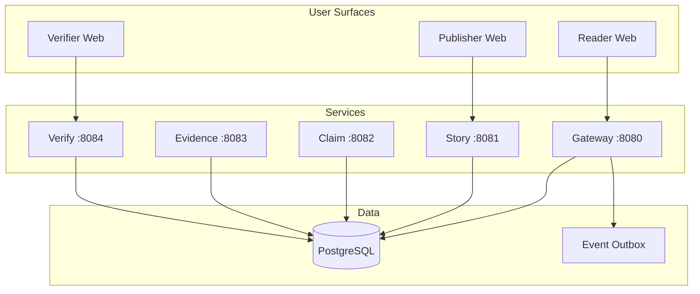

# The Actual News

**Verifiable news ledger platform — news as a public service.**

[](LICENSE)
[](https://github.com/the-actual-news/the-actual-news/actions/workflows/ci.yml)

Every story ships with three layers:

- **Narrative** — Human-readable piece, written for comprehension
- **Claims Ledger** — Machine-readable atomic claims with scope, time bounds, and confidence
- **Evidence Graph** — Links from each claim to primary evidence, counterevidence, and uncertainties

Publication is gated by deterministic quality policies, not engagement metrics.

## Architecture



## Quick Start

```bash
# Prerequisites: Docker, Node.js >= 20, pnpm >= 9

# Clone and install
git clone https://github.com/the-actual-news/the-actual-news.git
cd the-actual-news
pnpm install

# Start infrastructure (Postgres + Prism mock servers)
cp .env.example .env
make up

# Apply database migrations
make migrate

# Run conformance tests
make test

# Start the gateway service
make dev-minimal

# Start the full stack
make dev
```

## Project Structure

```
the-actual-news/
├── contracts/          # OpenAPI specs, event schemas, policy packs
├── db/migrations/      # PostgreSQL migrations (001-003)
├── docs/               # Architecture, roadmap, glossary
├── specs/              # Protocol spec and SDD artifacts
├── services/
│   ├── gateway/        # Public BFF (feed, story, publish)
│   ├── story/          # Story CRUD (stub)
│   ├── claim/          # Claim extraction (stub)
│   ├── evidence/       # Evidence registration (stub)
│   └── verify/         # Verification tasks (stub)
├── apps/public-web/    # Next.js reader + verifier UI
├── infra/              # Docker Compose + Postgres init
└── tools/
    ├── conformance/    # CT-01..CT-07 test suite
    └── migrate.sh      # Migration runner
```

## Key Concepts

| Concept | Description |
|---------|-------------|
| **Verification Spine** | Claims + evidence edges + corrections shipped with every story |
| **Policy Packs** | Versioned thresholds that gate publication (e.g., min evidence ratio) |
| **Publish Gate** | Deterministic decision: story publishes only when quality metrics pass |
| **Evidence Graph** | Content-addressed evidence linked to claims with typed relations |
| **Corrections Ledger** | Append-only corrections — history is never erased |

## Conformance Tests

The platform includes a conformance test suite (CT-01 through CT-07) that validates publish gate behavior against the [Core Protocol Spec](specs/protocol/core-protocol-spec-v1.md):

| Test | Scenario |
|------|----------|
| CT-01 | Minimal publish passes |
| CT-02 | Fails unsupported claim share |
| CT-03A | Ratio edge passes at 0.50 |
| CT-03B | Ratio fails at 0.60 |
| CT-04 | High-impact corroboration passes |
| CT-05 | Same independence key fails |
| CT-06 | Contradicted claims hard fail |
| CT-07 | Missing provenance treated conservatively |

## Documentation

- [Architecture](docs/architecture.md) — Platform design and service topology
- [Roadmap](docs/roadmap.md) — 10-phase program from prototype to archival permanence
- [Glossary](docs/glossary.md) — Terminology from the protocol spec
- [Protocol Spec](specs/protocol/core-protocol-spec-v1.md) — RFC-style core protocol
- [Design Document](docs/design/News-as-Public-Service.md) — Original design provenance

## Contributing

See [CONTRIBUTING.md](.github/CONTRIBUTING.md) for guidelines.

## License

[AGPL-3.0](LICENSE) — Because the public record should remain public.
